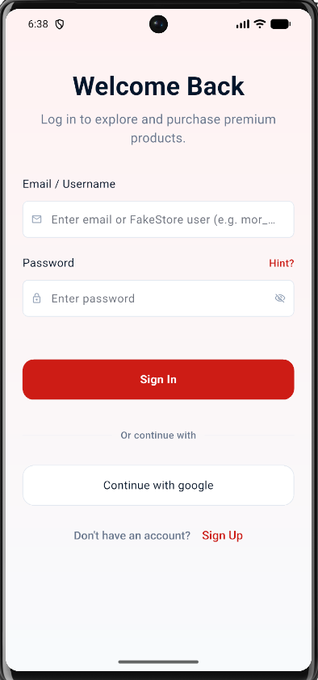
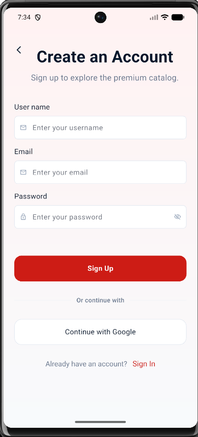
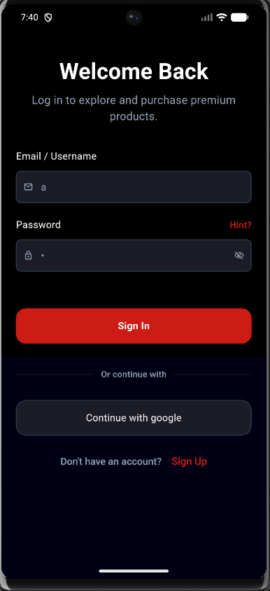
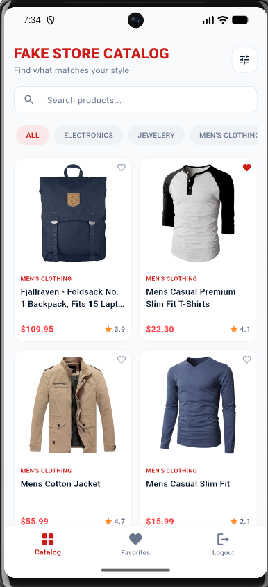
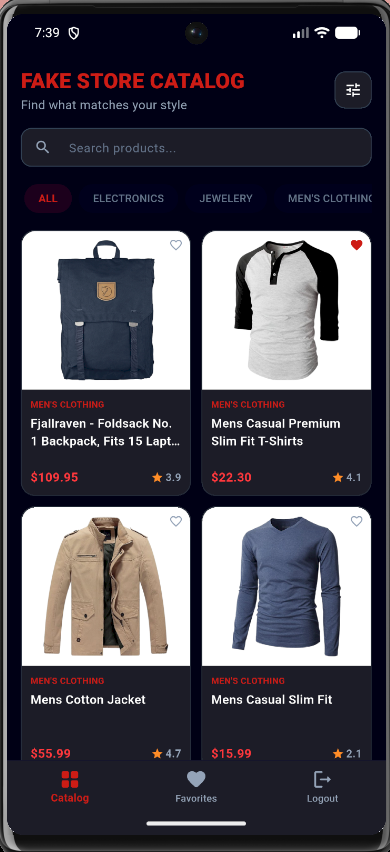
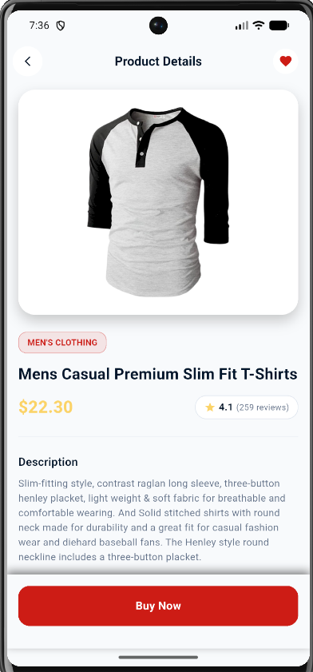
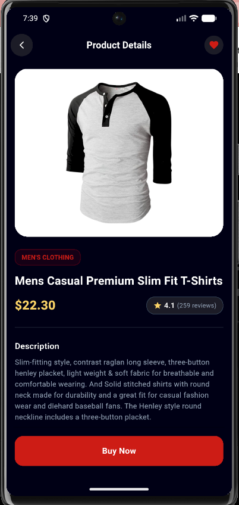
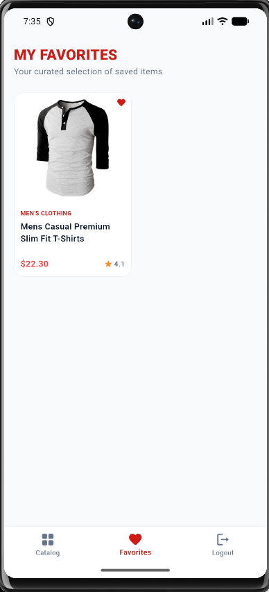
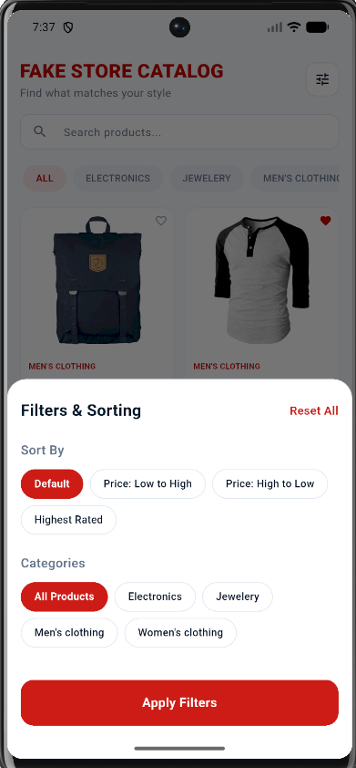
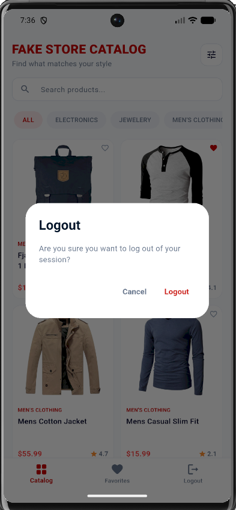

# Fake Store App - Technical Assessment

A production-quality Flutter application built as a developer technical assessment. The app integrates the [Fake Store REST API](https://fakestoreapi.com/) to render an interactive products catalog featuring category filtering, catalog search, sorting, curated local favorites, session management, dynamic light/dark mode support, and offline caching.

---

## 🏗️ Architecture & Folder Structure

This project follows a clean **MVVM (Model-View-ViewModel)** architectural pattern. In accordance with strict development requirements:
* **No `StatefulWidget`**: The UI consists entirely of `StatelessWidget` layout blocks. Local states (such as password obscurity) are managed using `ValueNotifier`/`ValueListenableBuilder`. ViewModel states are managed using `ChangeNotifier` and provided using the `Provider` library.
* **Separation of Concerns**: View layouts and widgets are completely separated from their business logic and state controllers.

```text
lib/
 ├── core/
 │    ├── common/          # Reusable shared global widgets (CustomTextfield, CustomButton, TextProperty, etc.)
 │    ├── services/        # NetworkCaller (Dio), AuthService, StorageService (SharedPreferences)
 │    └── utils/           # Device utilities, formatters, and dynamic ThemeColors
 ├── features/
 │    ├── auth_view/       # Authentication views, controllers (ViewModels), and models
 │    └── products/        # Products catalog dashboard, details, favorites views, repository, and controller
 ├── routes/               # Declarative navigation routing (GoRouter)
 └── main.dart             # Application initialization entry point
```

---

## 🌟 Key Features

1. **Authentication Flows**
   * **Login View**: Implements Username/Password login targeting the Fake Store auth API. (Tip: Use standard username `mor_2314` and password `83r5^_` to login using the live API).
   * **SignUp & OTP Views**: inputs validation flows.
2. **Products Catalog & Details**
   * **Interactive Dashboard**: Features a responsive grid card layout (adjusts to 2 columns on mobile and 3 columns on tablet screens).
   * **Search & Sort**: Filters catalog dynamically by query text. Sorts by **Price: Low to High**, **Price: High to Low**, and **Highest Rating**.
   * **Category TabBar**: Horizontal list that filters catalog categories with an animated sliding indicator under the active tab.
   * **Details View**: Shows rating count badges, descriptions, pricing, and an add-to-cart trigger.
3. **Local Favorites Caching**
   * Persists saved product IDs locally in `SharedPreferences`. Toggle favorites from either the Grid cards or the Details view with instant state sync.
4. **Robust Offline Mode**
   * Caches products list and category tags locally. If the network connection drops, the app loads cached data and displays an offline message.
   * Renders a custom **"Wifi Off"** screen with a **"Retry Now"** trigger if no offline cache is available.
5. **System Light & Dark Mode**
   * The app is configured with `ThemeMode.system` to automatically listen and adapt to the phone's system light and dark themes. Layouts, borders, text, inputs, and gradients adjust color palettes dynamically.

---

## 🛠️ Setup & Execution

### Prerequisites
* Flutter SDK (Stable Channel)
* Dart 3+

### Installation & Run
1. Clone the repository:
   ```bash
   git clone https://github.com/imAkashAd/plexus_cloud_task.git
   cd plexus_cloud_task
   ```
2. Fetch dependencies:
   ```bash
   flutter pub get
   ```
3. Run the application:
   ```bash
   flutter run
   ```

### Running Tests
Automated unit tests cover `ProductModel` deserialization and `ProductsController` search/filter/sorting states:
```bash
flutter test
```

---

## 📝 Assumptions & Notes
* **Mock Signup/OTP APIs**: Since the Fake Store API does not support signups or physical SMS OTP dispatch, these layouts validate inputs locally and simulate success before routing.
* **Inter Font**: The Inter font is loaded dynamically at runtime via the `google_fonts` package. 
* **Generic Error Handling**: Database and API network errors are wrapped inside clean generic `try-catch` blocks at the caller/controller layer, capturing raw exceptions and formatting them for the UI.


---

# 📸 Screenshots

## Authentication

| Login | Sign Up | Dark Login |
|-------|---------|---------|
|  |  |  |


## Home

| Light Mode | Dark Mode |
|------------|-----------|
|  |  |

---

## Product Details

| Light Mode | Dark Mode |
|------------|-----------|
|  |  |

---

## Favorites

| Favorites |
|-----------|
|  |

---

## Filter

| Filter Bottom Sheet |
|---------------------|
|  |

---

## Logout

| Logout Dialog |
|---------------|
|  |

---
